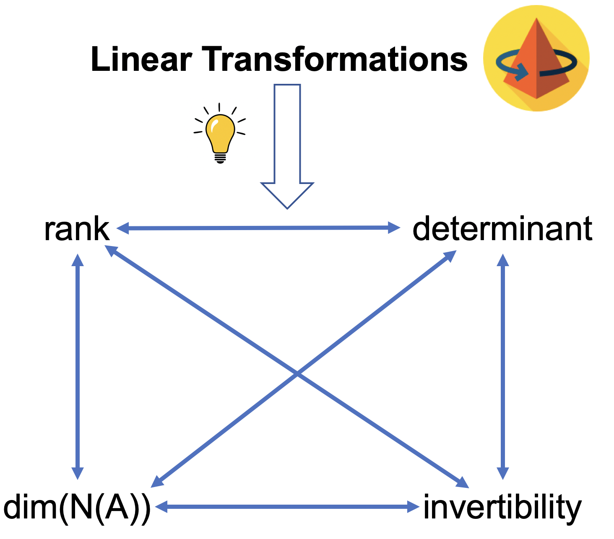

```{r setup, include=FALSE}
knitr::opts_chunk$set(echo = TRUE, out.width = "100%", fig.align='center', 
                      message=FALSE, warning = FALSE)
options(width = 1200)
```

# Introduction and objectives

This session will focus on linear maps. Specifically, we aim to accomplish the following objectives:

1. Leverage the geometry of linear maps to understand how the concepts of rank, null space, determinant and invertibility are connected.
2. Create, subset, join, operate and visualize matrices in R.


# Pre-requisites

Before attending this session, you should have done the following:

## Material

Watch the following videos:

- [Linear transformations and matrices, by 3blue1brown](https://www.youtube.com/watch?v=kYB8IZa5AuE&list=PLZHQObOWTQDPD3MizzM2xVFitgF8hE_ab&index=3).
- [Matrix multiplication as composition](https://www.youtube.com/watch?v=XkY2DOUCWMU)
- [More on linear independence](https://en.khanacademy.org/math/linear-algebra/vectors-and-spaces/linear-independence/v/more-on-linear-independence)
- [Relation between linear independence and null space](https://en.khanacademy.org/math/linear-algebra/vectors-and-spaces/null-column-space/v/null-space-3-relation-to-linear-independence)


Do the following exercises:

- [Guess the matrix that describes the transformation](https://en.khanacademy.org/math/linear-algebra/matrix-transformations/linear-transformations/a/practice-associating-matrices-with-transformations).


Check that you can access the following shiny app:

[https://massonix.shinyapps.io/linear_transformations/](https://massonix.shinyapps.io/linear_transformations/)


## Install software

- [R 4.0](https://cran.r-project.org/doc/manuals/r-devel/R-admin.html)
- [Rstudio](https://rstudio.com/products/rstudio/download/)
- [Bioconductor](https://www.bioconductor.org/install/)
- [pHeatmap](https://cran.r-project.org/web/packages/pheatmap/pheatmap.pdf)
- [Seurat](https://cran.r-project.org/web/packages/Seurat/index.html)
- [SeuratData](https://github.com/satijalab/seurat-data)


# Revision of key concepts

## Linear transformations

Simply put, we can think of a transformation as a function: something that takes an input vector and "spits" an output vector. In addition, they are considered linear if they fulfill these requirements:

1. The transformation of a sum of vectors equals the sum of the transformations:

$$
L(x + y) = L(x) + L(y)
$$

2. The transformation of a vector times a scalar equals the scalar times the transformed vector:

$$
L(\lambda x) = \lambda L(x)
$$

```{r echo=FALSE}
x <- matrix(c("x1", "x2"), nrow = 2)
i_hat <- matrix(c(1, 0), nrow = 2)
j_hat <- matrix(c(0, 1), nrow = 2)
write_matex2 <- function(x) {
  begin <- "\\begin{bmatrix}"
  end <- "\\end{bmatrix}"
  X <-
    apply(x, 1, function(x) {
      paste(
        paste(x, collapse = "&"),
        "\\\\"
      )
    })
  paste(c(begin, X, end), collapse = "")
}
```

To illustrate this, consider the following vector $x = `r write_matex2(x)`$, which can be expressed as a linear combination of the canonical basis vectors:

$$
x = x_1 `r write_matex2(i_hat)` + x_2 `r write_matex2(j_hat)`
$$

Let us take the linear transformation L of the vector x and apply the two properties of linear transformations:

$$
L(x) = L \left( x_1 `r write_matex2(i_hat)` + x_2 `r write_matex2(j_hat)`\right) = L \left(x_1 `r write_matex2(i_hat)`\right) + L \left(x_2 `r write_matex2(j_hat)`\right) = x_1 L\left(`r write_matex2(i_hat)`\right) + x_2 L\left(`r write_matex2(j_hat)`\right)
$$

From the last result, we can deduce two key facts:

1. Linear transformations are completely determined by where the basis vectors "land".
2. Linear transformation can be expresed as a matrix-vector product (Ax = b).

The (2) fact can be expressed as follows:

$$
Ax = b
$$
$$
x_1 a_1 + x_2 a_2 = b
$$
Where a<sub>1</sub> and a<sub>2</sub> are the column vectors of A (transformed basis vectors), x is the input vector and b is the output vector.


## Important definitions

* **Column space**: the colum space of a matrix A (C(A)) is the vector space spanned by the column vectors of A.
* **Rank**: number of linearly independent columns. In other words, the dimension of C(A).
* **Determinant**: factor by which a unit of length, area or volume is multiplied in a linear transformation.
* **Inverse matrix**: matrix that reverses a linear map. That is, if Ax = b, A^-1^b = x.
* **Null space**: all the vectors x that satisfy Ax = 0. That is, the set of vectors that are mapped to 0 in a linear transformation.

Again, the main objective is **to develop the geometric intuition of linear transformations to understand how these concepts are interconnected**:


There are two of these relations that are useful to understand algebraically:

1. Relation between rank and dim(N(A)):

$$
a_1, ... , a_n \hspace{0.2cm} are \hspace{0.2cm} linearly \hspace{0.3cm} independent \Longleftrightarrow N(A) = {0} 
$$

In words: a matrix A is full rank (= all column vectors are linearly independent) if and only if the null space only contains the 0 vector. You can find the proof of this theorem in the [Khan Academy](https://en.khanacademy.org/) videos in the prerequisites sections.

2. Relation between dim(N(A)) and invertibility: 

$$
\forall A_{nxn} \hspace{0.2cm} {\displaystyle \exists !} \hspace{0.2cm}A^{-1} \Longleftrightarrow N(A) = {0} 
$$

In words: for every square matrix A, there exists one and only one matrix A^-1^ if and only if the null space only contains the 0 vector. You can find the proof of this theorem in the [third lecture](https://www.youtube.com/watch?v=FX4C-JpTFgY) of the MIT course in linear algebra, by Gilbert Strang (timestamps: 27:56-31:50).


# Shiny app walkthrough

Herein, we will walk you through our shiny app that will allow us to fully understand linear transformations. Start by clicking the following link (or paste it to your favorite web browser):

[https://massonix.shinyapps.io/linear_transformations/](https://massonix.shinyapps.io/linear_transformations/)

As you can see, there are 4 tabs:

1. Visualization, which has two components. First, it contains an input box where the user should specify the number of dimensions and the matrix A that defines the linear transformation. Second, the plot pane shows the input and the output of the transformation.
2. Gauss-Jordan: it contains a calculator that performs Gauss-Jordan to find the inverse (if it exists). The operations are performed column-wise. With this tab you can prove the fundamental theorem of linear algebra, but for now it is beyond the scope of this session.
3. Null Space: it calculates and represents the null space of the input matrix.
4. Determinant: it calculates the determinant of the input matrix.

To illustrate how all these concepts are interconnected, we start by fixing the rank (number of linearly independent columns) and see how that affects the rest of properties. we will use the following example matrices:


```{r echo=FALSE}
E1 <- matrix(c(-2, 0, 0, -2), 2, 2, byrow = FALSE)
E2 <- matrix(c(1, 3, 3, 9), 2, 2, byrow = FALSE)
E3 <- matrix(c(1, 2, 3, 2, 4, 6, 3, 6, 9), 3, 3, byrow = FALSE)
```

$$
E1 = `r write_matex2(E1)`
$$

$$
E2 = `r write_matex2(E2)`
$$

$$
E3 = `r write_matex2(E3)`
$$

After this, you should realize two important connections:

1. If the matrix is not full rank the determinant is 0
2. dim(C(A)) + dim(N(A)) = n


# Reverse engineer linear transformations

## Basic transformations

**Exercise:** Now that you have an idea of how the app works, **try to find the matrix that describes the following linear transformations:**

1. expands space by a factor of 2 in all axis.
2. shrinks space to half its initial value
3. reflects every vector across the x = y line
4. rotates every vector by 30º (hint: use unit circle)
5. Smear

For each transformation, you should answer these questions:

- Are the column vectors linearly independent?
- Is the matrix invertible?
- Which is the dimension of the null space?
- Which is the determinant of A?


We will leave 5 min for each of them, and then we will ask one of you to tell us which matrix you guessed.

**TODO: DEFINE A BETTER LIST OF SIMPLE LINEAR MAPS**


## Composition of basic transformations

Importantly, you can think of matrix multiplication as a composition of single transformation. Let us take the following transformation:

$$
Cx = ABx = b
$$

The transformation C can be interpreted as first applying the transformation B to x, and then apply A to the resulting vector:

**TODO: insert image**

You can find a more thorough explanation in [this 3blue1brown video](https://www.youtube.com/watch?v=XkY2DOUCWMU).

Try to find the matrix that describes the following transformations:

1. Apply matrix (1) and then (3).
2. Apply matrix (2) and then (4).


**Challenge**: is matrix multiplication commutative? (hint: do you get the same result if you apply (1) then (3), or vice versa?)


# Matrix algebra with R

This section aims to teach the fundamentals of R to be able to perform linear algebra operations and visualize them. We will start by teaching the basic data structures, categorized by dimensionality (1D: atomic vectors + lists; 2D: matrices + data.frames) and whether they can contain only one value type (homogenous: atomic vectors and matrices) or more than one (heterogeneous: lists and data.frames). Moreover, here I showcase an example of the main functions we should cover in the hands-on session:


```{r}
# Load packages
library(Seurat)
library(SeuratData)
library(pheatmap)


# Create
x <- c(1, 2, 3)
A <- matrix(c(1, 2, 3, 4, 5, 6, 7, 8, 9), nrow = 3, ncol = 3, byrow = FALSE)
x 
A


# Get dimensions
length(x)
dim(A)
nrow(A)
ncol(A)


# Name
names(x) <- c("1", "2", "3")
rownames(A) <- c("a", "b", "c")
colnames(A) <- c("x", "y", "z")
x
A

# Subset
## Numeric
x[1]
x[c(2, 3)]
x[c(3, 3)]
A[1:3, -2]

## Character
x["b"]
A[c("a", "b"), ]

## Logical
x[c(FALSE, TRUE, TRUE)]
x > 1
x[x > 1]


# Concatenate
rbind(A, x)
cbind(A, x)


# Transpose
t(A)


# Matrix-vector operations
A + x
A * x
A %*% x
t(x[1] %*% A[, 1]) + t(x[2] %*% A[, 2]) + t(x[3] %*% A[, 3])

# Matrix-Matrix operations
A + A
A * A
A %*% A
```


