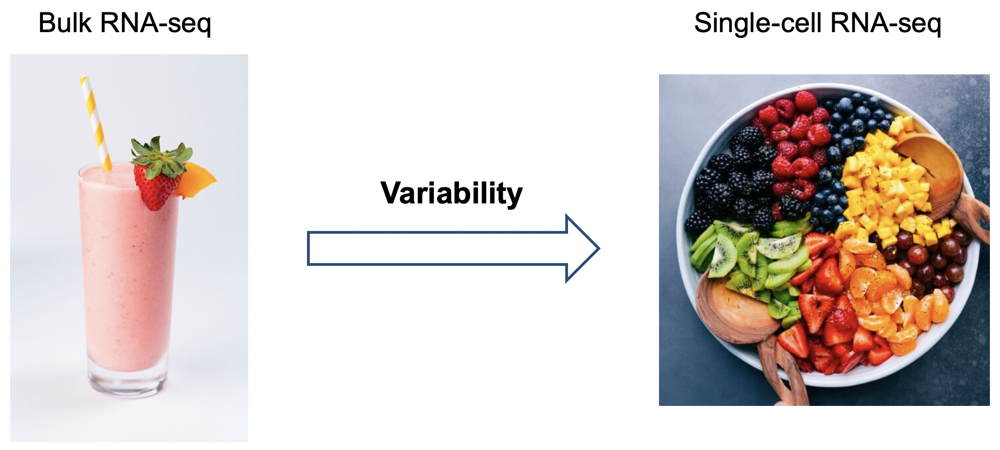
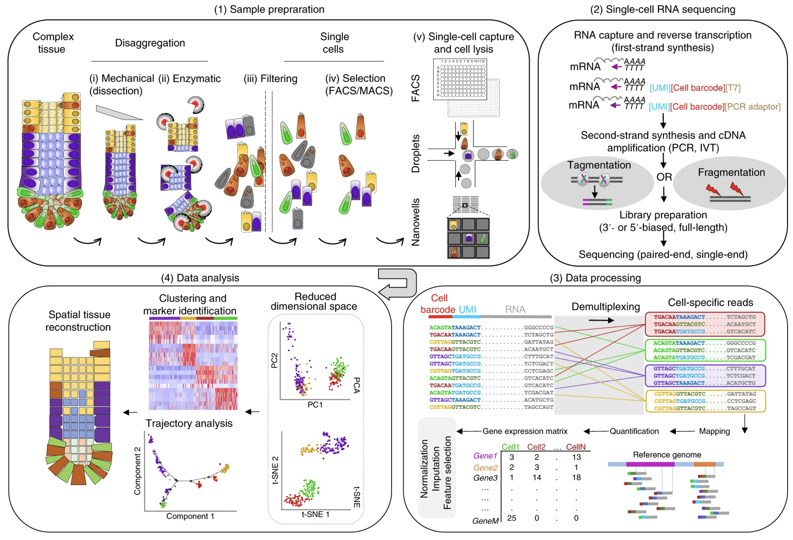
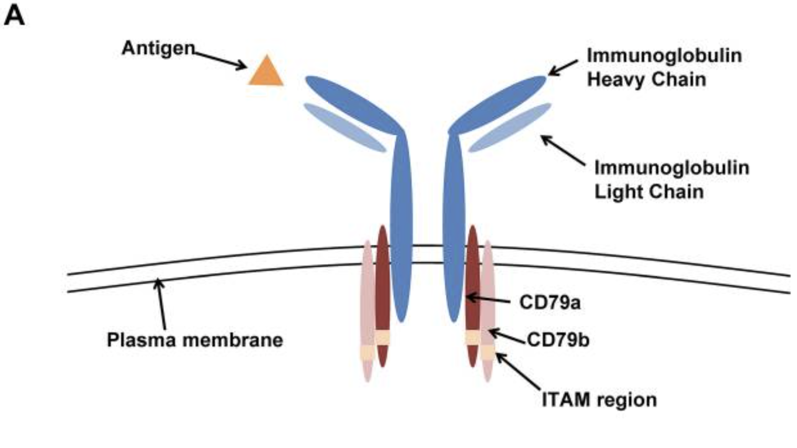
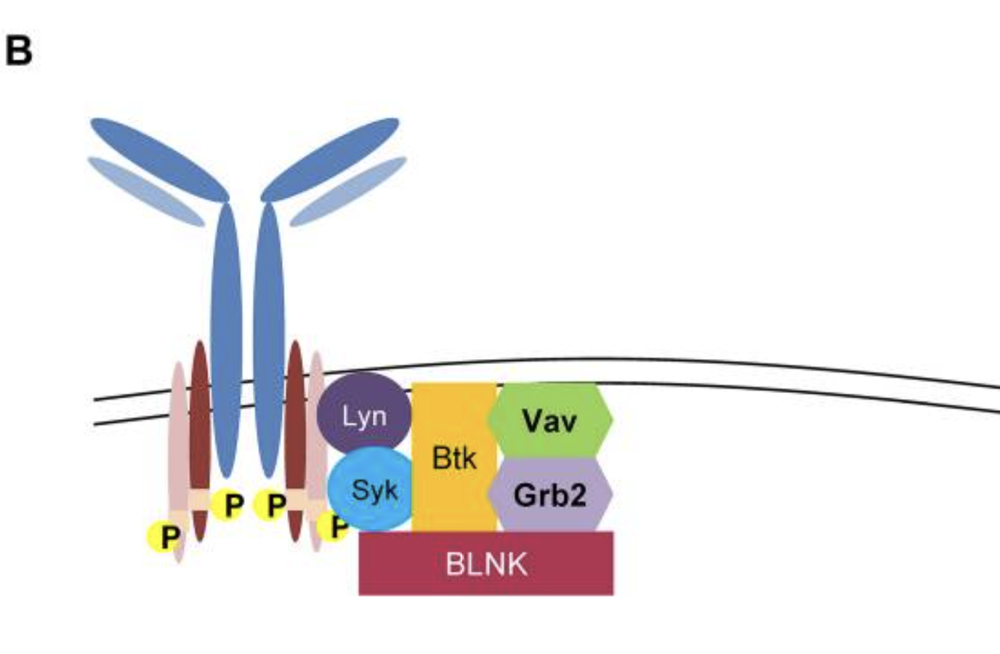

```{r setup, include=FALSE}
knitr::opts_chunk$set(echo = TRUE)
```


# Introduction and objectives

In this hands-on session, we will show how principal component analysis (PCA) is used in common bioinformatics workflows. We will use a toy [single-cell RNA-seq (scRNA-seq)](https://www.nature.com/articles/s41596-018-0073-y) dataset to illustrate it.

The main objectives are the following:

- Explain how PCA allows to reduce the noise and the redundancy of the dataset. Potentially talk about the 'curse of dimensionality'.
- Show how  principal components can act as hidden (or latent) variables that can be exploited to cluster observations into biologically meaningful groups.


# Pre-requisites

- Read [this tutorial](https://www.cs.cmu.edu/~elaw/papers/pca.pdf).
- Eigendecomposition of a matrix
- Singular Value Decomposition
- PCA
- Understand that total variance is computed by dividing a singular value over the sum of singular values. 


# Introduction to scRNA-seq






# Why use PCA?

## Eliminate noise

## Eliminate redundancy

# Case-study

## Load packages

```{r}
library(pheatmap)
library(tidyverse)
```


## Create and visualize toy dataset

```{r}
# Create toy dataset
toy <- data.frame(
  CD3D = c(4, 5, 4, 3, 0, 0, 0, 0, 0, 0, 0, 0, 0, 0),
  CD3E = c(5, 3, 4, 4, 0, 0, 0, 0, 0, 0, 0, 0, 0, 0),
  LYZ = c(0, 0, 0, 0, 5, 7, 6, 0, 0, 0, 0, 0, 0, 0),
  S100A8 = c(0, 0, 0, 0, 5, 7, 6, 0, 0, 0, 0, 0, 0, 0),
  CD79A = c(0, 0, 0, 0, 0, 0, 0, 6, 4, 4, 3, 5, 0, 0),
  CD79B = c(0, 0, 0, 0, 0, 0, 0, 5, 5, 3, 4, 6, 0, 0),
  BLNK = c(0, 0, 0, 0, 0, 0, 0, 6, 4, 5, 5, 4, 0, 0),
  TOP2A = c(0, 0, 0, 0, 0, 0, 0, 0, 0, 0, 12, 9, 0, 0),
  MKI = c(0, 0, 0, 0, 0, 0, 0, 0, 0, 0, 11, 10, 0, 0),
  MT_CO1 = c(0, 0, 0, 0, 0, 0, 0, 0, 0, 0, 0, 0, 18, 23),
  MT_ND5 = c(0, 0, 0, 0, 0, 0, 0, 0, 0, 0, 0, 0, 22, 25) 
)
rownames(toy) <- paste("cell", as.character(1:nrow(toy)))
toy <- as.matrix(toy)


# Visualize
pheatmap(toy, cluster_cols = FALSE, cluster_rows = FALSE, angle_col = 45)
```





Images obtained from [this link](https://ashpublications.org/blood/article/120/6/1175/30492/The-B-cell-receptor-signaling-pathway-as-a)


## PCA in R: 3 ways

Three ways to perform PCA in R: 

```{r}
# Regardless of the method, we will center and scale the dataset
toy_scaled <- scale(toy, center = TRUE, scale = TRUE)


# Eigendecomposition of the correlation matrix
corr_matrix <- (1 / (nrow(toy_scaled) - 1)) * (t(toy_scaled) %*% toy_scaled)
eigen_corr_matrix <- eigen(corr_matrix)
eigen_corr_matrix$values
pc_mat_by_eigen <- toy %*% eigen_corr_matrix$vectors


# SVD
toy_svd <- svd(toy)
toy_svd$d
toy_svd$v
toy_svd$u


# PCA
pca_out <- prcomp(toy, scale = TRUE)


# The singular values, PC scores and gene loadings are in the sdev, x and
# rotation, respectively
pca_out$sdev
pca_out$x
pca_out$rotation
```

Proportion of variance explained (PVE): https://faculty.marshall.usc.edu/gareth-james/ISL/ISLR%20Seventh%20Printing.pdf

```{r}
summary(pca_out)
```

## Infer dimensionality of the dataset

```{r}
# Calculate percentage of variance explained (PVE):
pve <- pca_out$sdev ** 2 / sum(pca_out$sdev ** 2) * 100
pve <- round(pve, 2)
pve_df <- data.frame(principal_component = 1:length(pve), pve = pve)
pve_gg <- pve_df %>%
  ggplot(aes(principal_component, pve)) +
    geom_point() +
    geom_vline(xintercept = 4.5, linetype = "dashed", color = "darkblue") +
    scale_x_continuous(breaks = 1:length(pve)) +
    labs(x = "Principal Component", y = "Percentage of Variance Explained (%)") +
    theme_bw()
pve_gg
```

Thus, we conclude that the first 4 PC are significant. Let us express each cell as a vector of the first 4 PC:

```{r}
toy_reduced <- pca_out$x[, c("PC1", "PC2", "PC3", "PC4")]
gene_loads_reduced <- pca_out$rotation[, c("PC1", "PC2", "PC3", "PC4")]
pheatmap(toy_reduced, cluster_rows = FALSE, cluster_cols = FALSE, angle_col = 45)
```


## Visualize gene loadings

```{r}
significant_pcs <- c("PC1", "PC2", "PC3", "PC4")
loadings_gg <- map(significant_pcs, function(x) {
  loadings <- gene_loads_reduced[, x]
  df <- data.frame(gene = names(loadings), score = loadings)
  p <- df %>%
    ggplot(aes(fct_reorder(gene, score), score)) +
      geom_point() +
      labs(x = "", y = x) +
      theme_bw() +
      coord_flip()
  return(p)
})
```

Interpretation of the PC:

*PC1: B cell identity.
*PC2: T vs monocyte separation.
*PC3: technical variation.
*PC4: cell cycle.


## Cluster cells

### Calculate all pairwise Euclidean distances

```{r}
dist_mat <- dist(toy_reduced, method = "euclidean")
pheatmap(dist_mat, cluster_rows = FALSE, cluster_cols = FALSE)
```


## Perform hierarchical clustering

```{r}
hclust_average <- hclust(dist_mat, method = "average")
plot(
  hclust_average,
  labels = rownames(toy),
  main = "Average Linkage",
  xlab = "",
  sub = "",
  ylab = ""
)
```


### Cut the dendrogram and visualize clusters

```{r}
plot(
  hclust_average,
  labels = rownames(toy),
  main = "Average Linkage",
  xlab = "",
  sub = "",
  ylab = ""
)
abline(h = 2.5, col = "red")
hc_clusters <- cutree(hclust_average, h = 2.5)
hc_clusters
table(hc_clusters)
annotation_rows <- data.frame(cluster = as.character(hc_clusters))
rownames(annotation_rows) <- names(hc_clusters)
pheatmap(
  toy_scaled,
  cluster_rows = FALSE,
  cluster_cols = FALSE,
  angle_col = 315,
  annotation_row = annotation_rows
)
```

### Annotation

| Cluster | Cell type          |
|---------|--------------------|
| 1       | T-cells            |
| 2       | Monocytes          |
| 3       | Naive B-cells      |
| 4       | Plasma Cells       |
| 5       | poor-quality cells |


```{r}
annotated_clusters <- c("T-cells", "Monocytes", "Naive B-cells", "Plasma Cells", "poor-quality cells")
names(annotated_clusters) <- as.character(1:5)
annotation_rows$annotation <- annotated_clusters[annotation_rows$cluster]
pheatmap(
  toy_scaled,
  cluster_rows = FALSE,
  cluster_cols = FALSE,
  angle_col = 315,
  annotation_row = annotation_rows
)
```


hierarchical clustering: concept of distance, pairwise distance.


# Session Information

```{r}
sessionInfo()
```

